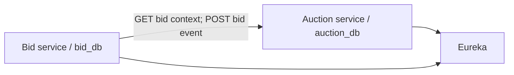

# Architecture

Auction service owns RFQs, timing, extension decisions, state, and activity logs. Bid service owns suppliers, quote history, and rankings. The services never access each other's database.
