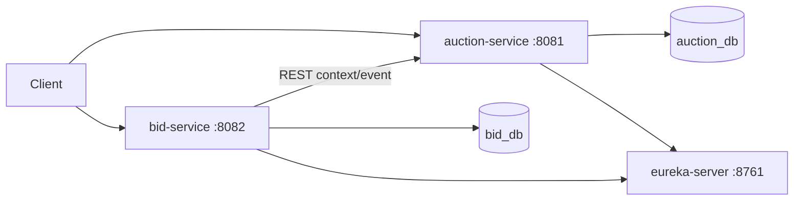
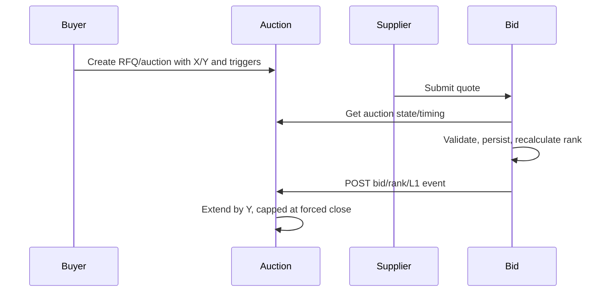
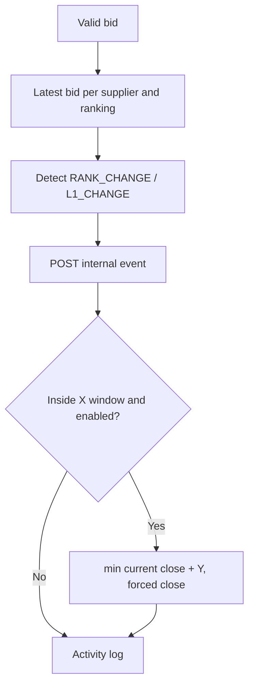

# Architecture

Auction service owns RFQs, lifecycle (`SCHEDULED`, `ACTIVE`, `CLOSED`, `FORCE_CLOSED`), configuration, timing, extensions, and activity logs. Bid service owns suppliers and bids, derives the latest bid per supplier, and calculates L1/L2/L3. Databases are independent: no cross-service foreign keys or direct cross-service reads. Bid processing and ranking are local to `bid_db`, so bid service can scale independently.

At forced close the auction resolves to `FORCE_CLOSED`; bids and extensions are rejected. Auction service records bid, rank, L1, and extension activity.
