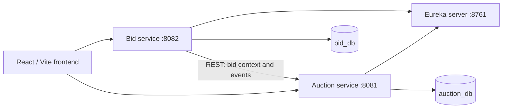

# RFQ Auction Assessment

An RFQ-based British Auction system. Buyers create RFQ auctions, suppliers submit progressively lower quotes, and qualifying bid activity near the close time can extend an auction without exceeding its forced close time.

The project supports RFQ creation, configurable extensions, supplier management, competitive bidding, L1/L2/L3 rankings, activity logging, forced-close protection, and a microservice architecture.

## Architecture



| Component | Responsibility |
|---|---|
| `eureka-server` | Service discovery only. |
| `auction-service` | RFQs, auction configuration/lifecycle, bid start/current-close/forced-close times, extension rules, and activity log. |
| `bid-service` | Suppliers, bids, bid validation, latest-bid rankings, L1/L2/L3 calculation, and BID_RECEIVED/RANK_CHANGE/L1_CHANGE detection. |
| `frontend` | React user interface for creating auctions, viewing auction data, and submitting supplier bids. |

Services communicate through REST. Each service owns its own database tables; there are no cross-service database foreign keys.

## Auction Extension Logic

Each auction stores a trigger window **X** and extension duration **Y**, both in minutes. Enabled qualifying activity inside the final X minutes of the current close time can extend it by Y minutes:

- `BID_RECEIVED`: a new bid is received.
- `RANK_CHANGE`: a supplier's rank changes.
- `L1_CHANGE`: the lowest-ranked supplier changes.

Repeated extensions are supported. Every resulting close time is capped at the forced close time; an auction never extends beyond it.

## Technology Stack

- Java 17, Spring Boot 4.1.1, Spring Cloud 2025.1.3
- Maven, Spring Data JPA, MySQL Connector/J, Lombok
- Spring Cloud Netflix Eureka, Springdoc OpenAPI 3.0.3
- JUnit 5 through Spring Boot Test; H2 for tests
- React 19, Vite 8, React Router 7, Axios 1, Tailwind CSS 4

## Project Structure

```text
rfq-auction-assessment/
├── eureka-server/     # discovery server
├── auction-service/   # RFQ, auction, extension, activity ownership
├── bid-service/       # supplier, bid, ranking ownership
├── frontend/          # React/Vite user interface
├── API.md             # API contract details
├── ARCHITECTURE.md
├── ASSUMPTIONS.md
└── README.md
```

## Prerequisites

- Java 17 or later
- MySQL 8
- Node.js and npm compatible with Vite 8

Each backend project includes Maven Wrapper scripts, so a separate Maven installation is optional.

## Database Setup

The services use separate logical databases:

```sql
CREATE DATABASE auction_db;
CREATE DATABASE bid_db;
```

The JDBC URLs include `createDatabaseIfNotExist=true`. Provide your own local database credentials through environment variables; do not commit credentials.

## Configuration

Backend configuration is stored in each service's `src/main/resources/application.properties`.

| Service | Environment variable | Purpose |
|---|---|---|
| auction-service | `AUCTION_DB_URL`, `AUCTION_DB_USERNAME`, `AUCTION_DB_PASSWORD` | Auction database connection. |
| bid-service | `BID_DB_URL`, `BID_DB_USERNAME`, `BID_DB_PASSWORD` | Bid database connection. |
| auction-service, bid-service | `EUREKA_URL` | Eureka URL; default: `http://localhost:8761/eureka/`. |
| bid-service | `AUCTION_SERVICE_URL` | Auction-service URL; default: `http://localhost:8081`. |

The frontend uses existing Vite environment variables in `frontend/.env`:

```dotenv
VITE_AUCTION_URL=http://localhost:8081
VITE_BID_URL=http://localhost:8082
```

They are consumed by the existing `AUCTION_API` and `BID_API` constants. These values are local examples; use values appropriate to your environment.

## Running the Backend

Start MySQL, then open three PowerShell terminals in order:

```powershell
cd eureka-server
.\mvnw.cmd spring-boot:run
```

```powershell
cd auction-service
.\mvnw.cmd spring-boot:run
```

```powershell
cd bid-service
.\mvnw.cmd spring-boot:run
```

## Running the Frontend

```powershell
cd frontend
npm install
npm run dev
```

Vite serves the development application at `http://localhost:5173` by default.

## Service URLs

| Service | URL |
|---|---|
| Eureka | http://localhost:8761 |
| Auction service | http://localhost:8081 |
| Bid service | http://localhost:8082 |
| Frontend (Vite default) | http://localhost:5173 |
| Auction Swagger UI | http://localhost:8081/swagger-ui/index.html |
| Bid Swagger UI | http://localhost:8082/swagger-ui/index.html |

## REST API Overview

### Public auction APIs (`:8081`)

| Method | Path | Purpose |
|---|---|---|
| POST | `/api/auctions` | Create an RFQ and auction configuration. |
| GET | `/api/auctions` | List auctions. |
| GET | `/api/auctions/{id}` | Get configuration, times, and state. |
| GET | `/api/auctions/{id}/activity` | Get activity records. |

### Public bid APIs (`:8082`)

| Method | Path | Purpose |
|---|---|---|
| POST | `/api/suppliers` | Create a supplier. |
| GET | `/api/suppliers` | List suppliers. |
| POST | `/api/bids` | Submit a supplier quote. |
| GET | `/api/auctions/{id}/bids` | Get bid history. |
| GET | `/api/auctions/{id}/rankings` | Get each supplier's latest quote, ranked L1 onward. |
| GET | `/api/auctions/{id}/summary` | Get the current lowest bid and supplier, when present. |

### Internal service APIs (`:8081`)

These are consumed by bid-service, not the frontend:

| Method | Path | Purpose |
|---|---|---|
| GET | `/internal/auctions/{id}/bid-context` | Read authoritative auction bidding state and times. |
| POST | `/internal/auctions/{id}/events` | Notify auction-service about bid, rank, and L1 events. |

See [API.md](API.md) for request fields and response details.

## Auction and Bidding Flow

1. A buyer creates an RFQ auction with start, close, forced-close, trigger, and extension settings.
2. Suppliers exist as participating supplier entities.
3. A supplier submits an initial quote, then may submit strictly lower replacements.
4. bid-service calculates the latest valid bid per supplier and determines L1/L2/L3.
5. bid-service notifies auction-service of bid/rank/L1 events.
6. Enabled qualifying activity inside the trigger window may extend the auction.
7. The extension is capped at forced close; closed auctions reject later bids.

Example: Alpha bids 1,000, Beta 980, and Gamma 960. Gamma is L1, Beta L2, and Alpha L3. A qualifying Gamma bid inside the trigger window can extend closing by Y minutes, capped at forced close.

For this assessment, suppliers are pre-registered entities. The frontend selector represents the supplier context for bid submission. Authentication, user registration, and authorization are not implemented.

## Validation and Business Rules

- Backend money calculations use `BigDecimal`; total amount is freight + origin + destination.
- Backend timestamps use UTC `Instant`; the frontend displays valid API timestamps in the browser's local timezone.
- Forced close must be later than the initial bid close; at least one trigger is required.
- Bids require an active auction within its accepted time window and an active supplier.
- A replacement bid must strictly improve that supplier's latest bid.
- Rankings use each supplier's latest bid, ordered by total amount.
- Closed and force-closed auctions reject bids.

## Testing

Run backend tests separately:

```powershell
cd auction-service; .\mvnw.cmd clean test
cd ..\bid-service; .\mvnw.cmd clean test
cd ..\eureka-server; .\mvnw.cmd clean test
```

Current tests cover auction configuration and extension rules, trigger-window boundaries, repeated extensions capped by forced close, and latest-bid ranking behavior.

Validate the frontend:

```powershell
cd frontend
npm run lint
npm run build
```

## Security, Assumptions, and Out of Scope

- No real credentials are committed; configure your own local MySQL credentials.
- Authentication, login, registration, supplier invitation, and authorization are outside the assessment scope.
- Production identity management, Kafka/RabbitMQ, Redis, Kubernetes, and other unrequired infrastructure are not included.

## Known Limitations

- No authentication or authorization layer exists.
- Suppliers are created through the supplied API; the frontend selects existing active suppliers for bid submission.
- The frontend uses API URLs supplied through its local Vite environment file.
